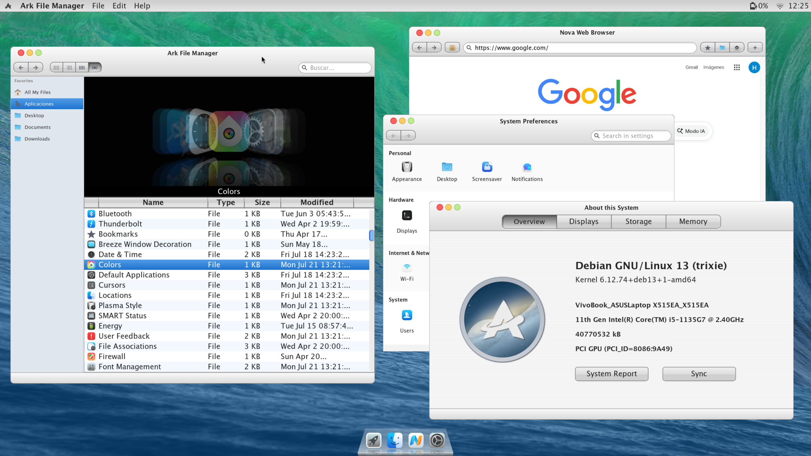

<p align="center">
  
</p>

# Austral OS

<p align="center">
  
  
  
  
  
</p>

**A vertically integrated desktop system built on Debian, powered by the [Horizon framework](https://github.com/austral-os/horizon).**

Austral OS is a minimal, Debian-based operating system designed with a single purpose: to provide a pure, vertically integrated environment for the [**Horizon**](https://github.com/austral-os/horizon) desktop framework. Unlike traditional distributions that layer components from various ecosystems, Austral OS is an intentional system where the UI, core applications, and system integration are built to work as one.

---

## 🖼️ Preview

  
_Main desktop view showcasing the [Horizon Shell](https://github.com/austral-os/horizon) and native applications._

---

## ⚠️ Project Status: ALPHA

Austral OS is currently in **Alpha state**.

- **Expect bugs:** The system is functional but unstable.
- **Incomplete features:** Many settings and system components are still under development.
- **Developer-focused:** This is currently intended for developers, testers, and those curious about the [Horizon framework](https://github.com/austral-os/horizon).

**Do not use this as your primary operating system yet.**

---

## What is Austral OS?

Austral OS is not intended to be another general-purpose distribution. Instead, it serves as a reference implementation of a desktop environment built around simplicity, control, and a fully integrated UI stack.

- **Base:** Built on a minimal Debian foundation for stability and package availability.
- **No GTK / No Qt:** The entire user interface is built using the [**Horizon** framework](https://github.com/austral-os/horizon), ensuring a lightweight and consistent experience.
- **Full Control:** By building the stack from the UI framework up to the shell, we maintain absolute control over the user experience and system performance.
- **Refined Aesthetics:** The interface draws inspiration from classic macOS releases (such as Mavericks and Leopard), reinterpreted within a modern Wayland-based Linux system.

---

## What’s Included?

The system comes pre-loaded with a suite of core applications, all built natively with the [Horizon framework](https://github.com/austral-os/horizon):

- **[Horizon Shell](https://github.com/austral-os/horizon):** A modern Wayland-based panel, dock, and workspace manager.
- **Nova Browser:** A custom web browser optimized for the system.
- **File Manager:** A simple, fast explorer for your data.
- **Terminal:** Low-latency terminal emulator.
- **Text Editor:** Clean, distraction-free writing environment.
- **System Settings:** Centralized control (currently in progress).

---

## The Philosophy: Vertical Integration

The modern Linux desktop is often a patchwork of different libraries, design languages, and legacy code. Austral OS takes a different path:

1. **Consistency:** Every pixel is drawn by the same framework.
2. **Efficiency:** By removing the overhead of generic toolkits, we achieve a faster, more responsive UI.
3. **Simplicity:** We only include what is necessary to run the [Horizon experience](https://github.com/austral-os/horizon).

---

## 🛠️ Download & Try

Download the latest ISO from the releases page:

👉 https://github.com/austral-os/austral-os/releases/tag/v0.1.0-alpha

## 🛠️ Build from Source

If you want to modify or rebuild Austral OS, you can generate the ISO using `live-build`.

### Prerequisites

- A Debian-based host system
- `live-build` installed

### Build Instructions

1. Clone this repository.
2. Ensure you have the latest `horizon-desktop.deb` package.
3. Place the package in: `config/live-build/config/includes.chroot/root/packages/`
4. Run the build process:

```bash
cd config/live-build
sudo lb clean --all
sudo lb config
sudo lb build
```

The resulting `.iso` file can be flashed to a USB drive or booted in a virtual machine (Wayland support required).

---

## Relation to [Horizon](https://github.com/austral-os/horizon)

Austral OS is the official reference platform for the [Horizon UI Framework](https://github.com/austral-os/horizon). While [Horizon](https://github.com/austral-os/horizon) can technically run on other systems, Austral OS is where it is designed to shine.

If you are a developer looking to build apps for [Horizon](https://github.com/austral-os/horizon), this is your testing ground.

---

## Contributing

This project is currently developed by a single developer. Feedback, bug reports, and contributions are extremely welcome.

- **Found a bug?** Open an issue on GitHub.
- **Have an idea?** Start a discussion.
- **Want to code?** Check the issues list and feel free to submit a Pull Request.

---

**Built with passion. Driven by [Horizon](https://github.com/austral-os/horizon).**
